# IndiaLens AI 🌍

> **An AI-powered Global Intelligence Dashboard built with Next.js, TypeScript, Prisma ORM, PostgreSQL, Google Gemini AI, and interactive data visualizations.**

IndiaLens AI helps users explore India's global performance across economy, governance, technology, healthcare, education, sustainability, innovation, and other international indicators. The platform combines interactive dashboards, historical trend analysis, cross-country comparisons, AI-powered insights, and report generation to make complex global datasets easy to understand.

---

## 🚀 Live Demo

🌐 **Live Website:** https://india-lens-ai-omega.vercel.app

---

## 🌟 Highlights

- 🤖 AI-powered global intelligence assistant using Google Gemini
- 🌍 Explore 85+ international indicators
- 📊 Interactive analytics dashboard
- ⚖️ Cross-country comparison engine
- 📈 Historical trend analysis
- 🗺️ Interactive world map
- 📑 Export reports in PDF & CSV
- 🌙 Dark & Light themes
- 📱 Fully responsive modern UI

---

# ✨ Features

## 📊 Global Dashboard

- Interactive KPI cards
- Executive overview
- AI-powered insight drawers
- Performance summaries
- Indicator snapshots

---

## 🌍 Country Comparison

Compare India with major countries across:

- Economy
- Governance
- Technology
- Healthcare
- Education
- Environment
- Society
- Safety
- Equality
- Digital Government

Includes:

- AI-generated comparison summary
- Interactive comparison cards
- Radar chart visualization
- Country performance breakdown

---

## 🤖 AI Intelligence

Powered by **Google Gemini AI**

Supports:

- Country performance analysis
- Indicator explanations
- Executive summaries
- Trend analysis
- Cross-country comparisons
- Strategic recommendations

---

## 📈 Historical Trends

- Multi-year ranking analysis
- Trend visualization
- Interactive charts
- Historical performance tracking
- Growth analysis

---

## 🗺️ Interactive World Map

- Country ranking visualization
- Geographic exploration
- Global indicator mapping
- Interactive country selection

---

## 📂 Categories

Browse indicators across:

- Economy
- Society
- Governance
- Technology
- Education
- Healthcare
- Environment
- Safety
- Equality
- Digital Government

---

## 📑 Reports

- Executive reports
- PDF export
- CSV export
- AI-generated summaries
- Downloadable analytics

---

## 📚 Data Sources

Data is organized from globally recognized organizations including:

- World Bank
- IMF
- WHO
- UNDP
- WIPO
- World Economic Forum
- Transparency International
- Our World in Data

---

## 🌙 User Experience

- Dark Mode
- Light Mode
- Fully Responsive
- AI Insight Drawers
- Smooth Animations
- Interactive Visualizations

---

# 🛠 Tech Stack

## Frontend

- Next.js 16 (App Router)
- React 19
- TypeScript
- Tailwind CSS v4
- Framer Motion
- Lucide React

## AI

- Google Gemini 2.5 Flash API

## Data Visualization

- Recharts
- Leaflet
- React Leaflet

## State Management

- TanStack React Query v5
- next-themes

## Data Source

- Curated Static TypeScript/JSON Datasets

## Deployment

- Vercel

---

# 📂 Project Structure

```text
src/
├── app/
├── components/
│   ├── ai-insights/
│   ├── dashboard/
│   ├── categories/
│   ├── compare/
│   ├── reports/
│   ├── world-map/
│   ├── trends/
│   └── common/
├── data/
├── hooks/
├── lib/
├── providers/
├── styles/
└── types/

prisma/

public/

screenshots/
```

---

# 📸 Screenshots

## 🏠 Home

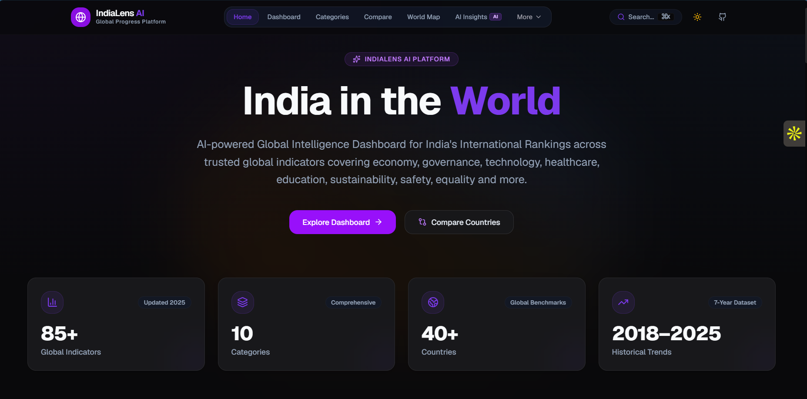

---

## 📊 Dashboard

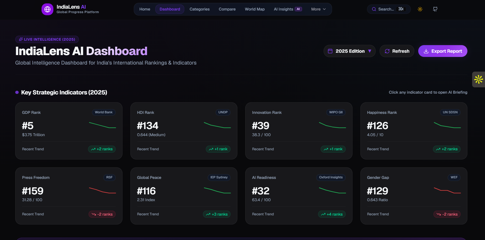

---

## 📂 Categories

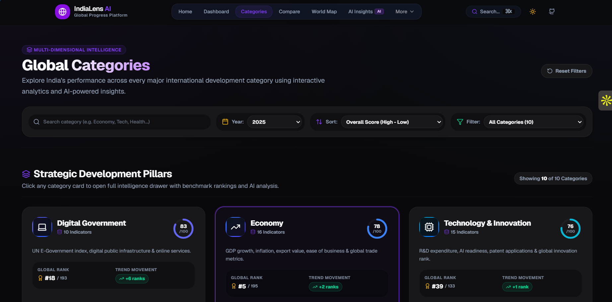

---

## 🌍 Compare Countries

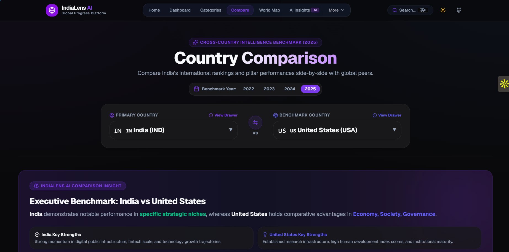

---

## 🗺️ World Map

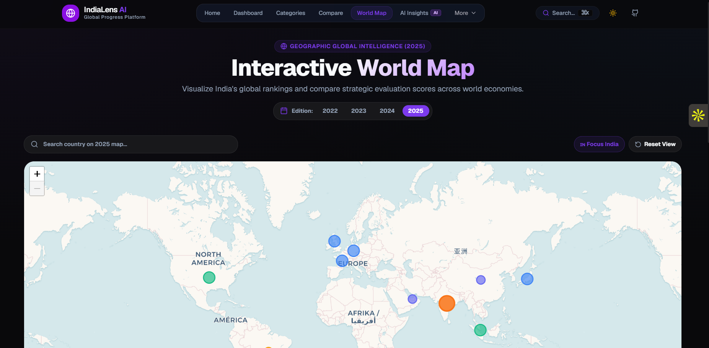

---

## 📈 Trends

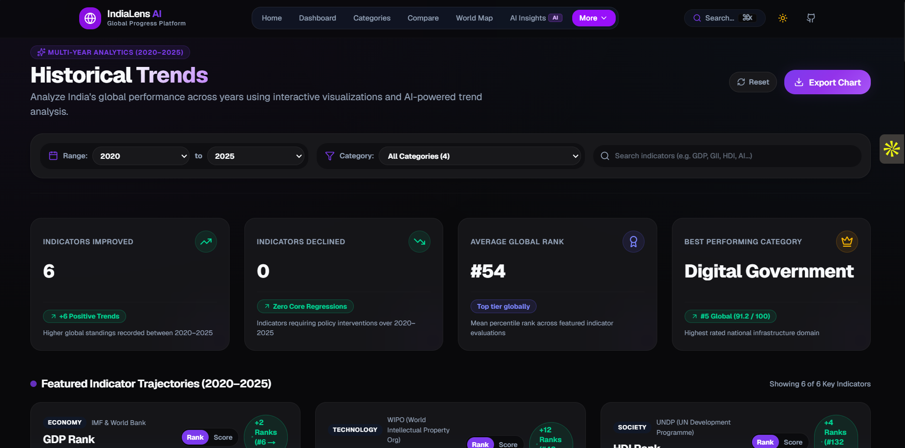

---

## 🤖 AI Insights

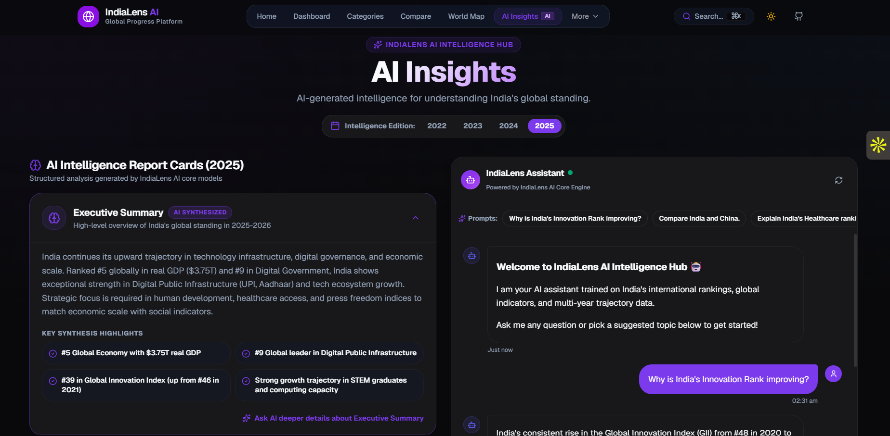

---

## 💡 AI Insight Drawer

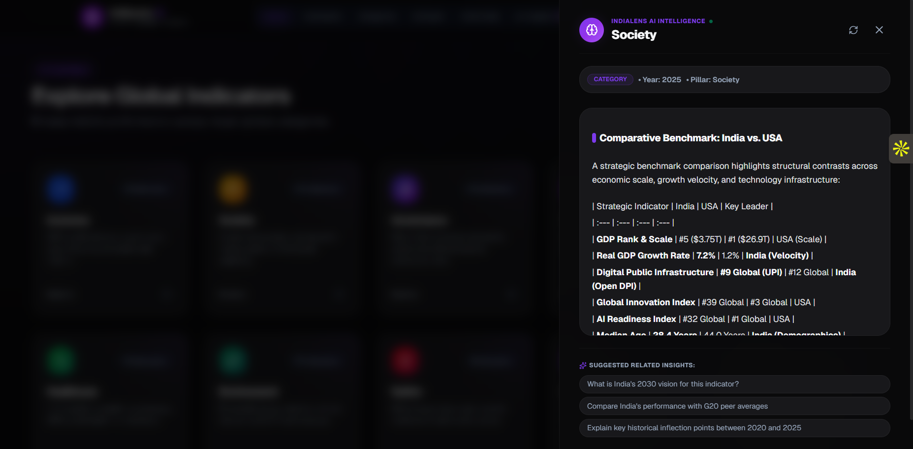

---

## 📑 Reports

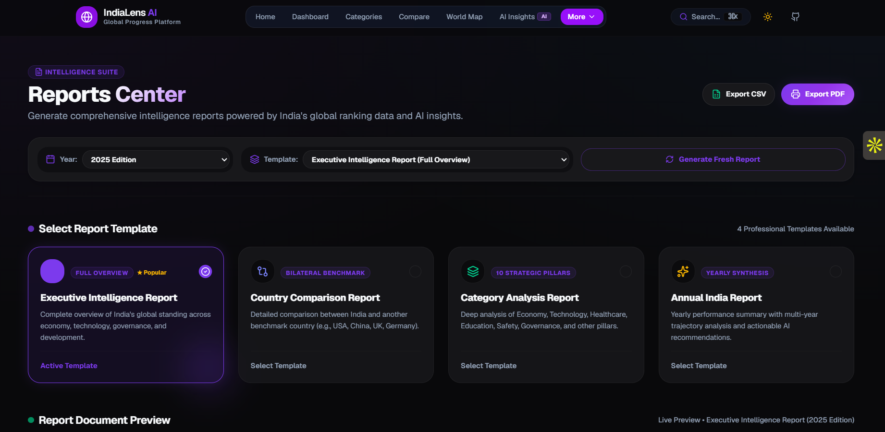

---

## 📚 Sources

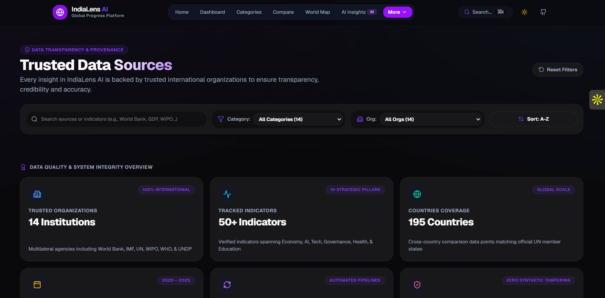

---

## ☀️ Light Theme

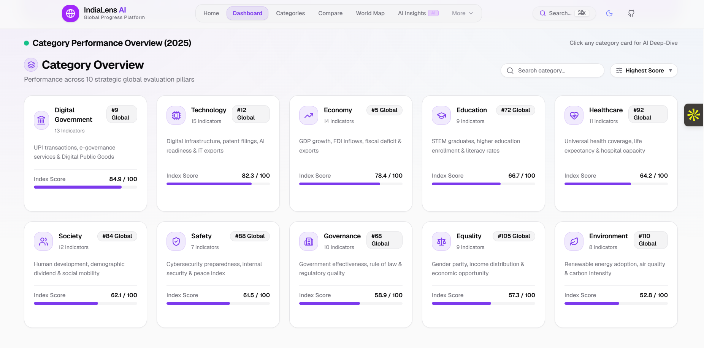

---

# ⚙️ Installation

Clone the repository

```bash
git clone https://github.com/Meghana-Merla/india-global-progress.git
```

Move into the project

```bash
cd india-global-progress
```

Install dependencies

```bash
npm install
```

Create a `.env.local` file

```env
GEMINI_API_KEY=your_google_gemini_api_key
```

Run the development server

```bash
npm run dev
```

Open:

```
http://localhost:3000
```

Build for production

```bash
npm run build
npm run start
```

---

# 📡 Major Modules

## 📊 Dashboard

Interactive overview of India's global indicators.

---

## 📂 Categories

Browse indicator categories with AI explanations.

---

## 🌍 Compare

Compare India's performance with other countries.

---

## 🗺️ World Map

Explore countries geographically with global rankings.

---

## 📈 Trends

Visualize historical indicator trends.

---

## 🤖 AI Insights

Ask questions and receive contextual AI-generated intelligence.

---

## 📑 Reports

Generate executive reports and export data as PDF or CSV.

---

## 📚 Sources

Browse trusted global organizations powering the dataset.

---

# 🎯 Future Improvements

- Live integration with official APIs (World Bank, IMF, WHO, UN)
- User authentication and personalized dashboards
- Bookmark favorite indicators and reports
- Scheduled report generation and email delivery
- AI-powered predictive trend forecasting
- Multi-language support
- Advanced filtering and analytics
- Public REST API for indicator data

---

# 👨‍💻 Author

**Meghana Merla**

GitHub: https://github.com/Meghana-Merla

LinkedIn: https://www.linkedin.com/in/durga-naga-meghana-merla-9338b7320/

---

## ⭐ If you like this project

Give this repository a ⭐ on GitHub!
